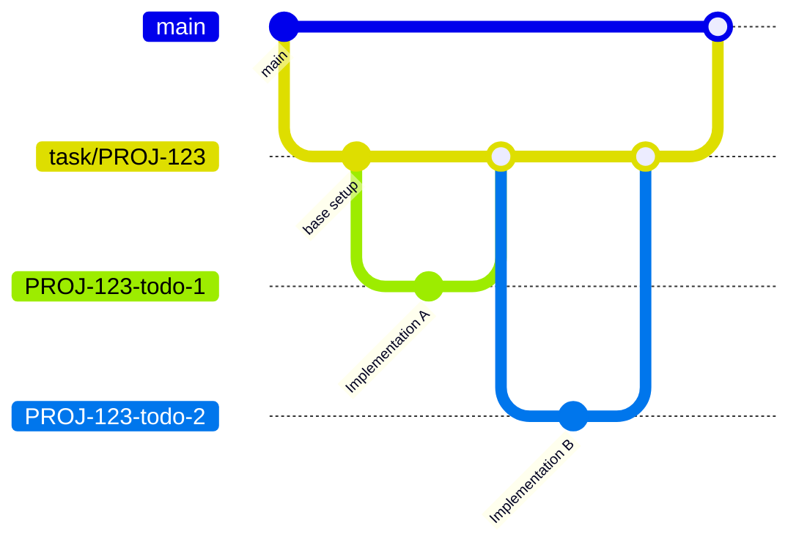

# JJ Workspace Bookmark Strategy

track adopts a hierarchical bookmark strategy using JJ workspaces to manage tasks and subtasks (TODOs) efficiently. This strategy ensures independent working environments for granular units of work while maintaining a clean task history.

## Concept: Hierarchical Bookmarks



The workflow consists of three layers:

1.  **Main Bookmark (`main` / `master`)**:
    -   The production-ready state.
    -   Tasks are merged here via Pull Requests (PRs).

2.  **Feature Base Bookmark (`task/{ticket_id}` or `task-{task_id}`)**:
    -   Corresponds to a `track` Task.
    -   Acts as the integration bookmark for a specific feature or ticket.
    -   Created via `track sync` after registering repositories.

3.  **Unit Work Bookmark (`{ticket_id}-todo-{task_index}` or `task-{task_id}-todo-{task_index}`):**
    -   Corresponds to a `track` TODO.
    -   Used for implementing a specific, small unit of work.
    -   Created via `track todo add --worktree` followed by `track sync`.
    -   Automatically rebased onto the Feature Base Bookmark and deleted upon completion (`track todo done`).

## Workflow

### 1. Start a Task

Create a new task in `track` linked to an issue tracker ticket.

```bash
track new "Implement Auth" --ticket PROJ-123
```

### 2. Register Repositories

Register the repositories you want to work with for this task.

```bash
cd ~/src/my-repo
track repo add
```

### 3. Break Down into TODOs

Define granular steps for the task. Use `--worktree` flag to schedule workspace creation.

```bash
track todo add "Setup JWT middleware" --worktree
```

### 4. Sync Repositories

Run `track sync` to create the task bookmark and workspaces for TODOs with `--worktree` flag.

```bash
# Creates bookmark 'task/PROJ-123' in registered repos
# Creates workspaces for pending TODOs at <repo_root>/PROJ-123-todo-1
track sync
```

### 5. Develop and Complete

Work in the generated workspace. When finished, use `track todo done` to automate the cleanup.

```bash
# 1. Checks for uncommitted changes
# 2. Rebases 'PROJ-123-todo-1' onto 'task/PROJ-123'
# 3. Removes the workspace
track todo done 1
```

### 6. Finish Task

Once all TODOs are done and rebased onto the base bookmark, you can create a PR from the base bookmark to main.

```bash
track archive t:PROJ-123
```
