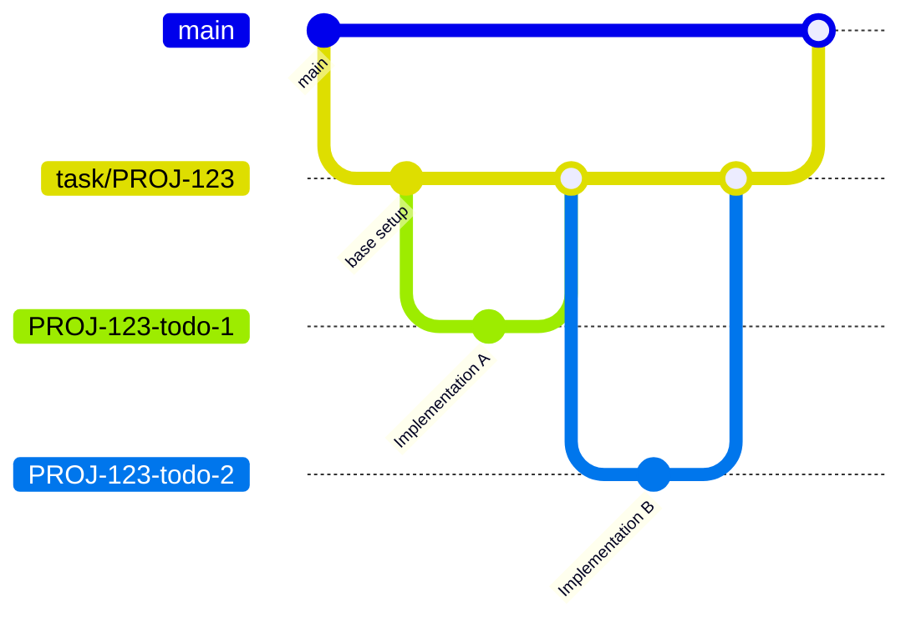

# Git Worktree Branch Strategy

track adopts a hierarchical branching strategy using Git Worktrees to manage tasks and subtasks (TODOs) efficiently. This strategy ensures independent working environments for granular units of work while maintaining a clean task history.

## Concept: Hierarchical Branching



The workflow consists of three layers:

1.  **Main Branch (`main` / `master`)**:
    -   The production-ready state.
    -   Tasks are merged here via Pull Requests (PRs).

2.  **Feature Base Branch (`task/{ticket_id}` or `task-{task_id}`)**:
    -   Corresponds to a `track` Task.
    -   Acts as the integration branch for a specific feature or ticket.
    -   Created via `track worktree init`.

3.  **Unit Work Branch (`{ticket_id}-todo-{todo_id}`)**:
    -   Corresponds to a `track` TODO.
    -   Used for implementing a specific, small unit of work.
    -   Created via `track worktree add --todo <id>`.
    -   Automatically merged back to the Feature Base Branch and deleted upon completion (`track todo done`).

## Workflow

### 1. Start a Task

Create a new task in `track` linked to an issue tracker ticket.

```bash
track new "Implement Auth" --ticket PROJ-123
```

### 2. Initialize Base Worktree

Create the Feature Base Branch and its corresponding worktree. This will be the parent for all TODO branches.

```bash
# Creates branch 'task/PROJ-123' at ../<repo>-worktrees/task/PROJ-123
track worktree init ~/src/my-repo
```

### 3. Break Down into TODOs

Define granular steps for the task.

```bash
track todo add "Setup JWT middleware"
```

### 4. Start a Unit of Work

Create a worktree specifically for a TODO. This isolates your workspace for that specific subtask.

```bash
# Creates branch 'PROJ-123-todo-1' from 'task/PROJ-123'
track worktree add ~/src/my-repo --todo 1
```

### 5. Develop and Complete

Work in the generated worktree. When finished, use `track todo done` to automate the cleanup.

```bash
# 1. Checks for uncommitted changes
# 2. Merges 'PROJ-123-todo-1' into 'task/PROJ-123'
# 3. Removes the worktree and deletes the branch
track todo done 1
```

### 6. Finish Task

Once all TODOs are done and merged into the base branch, you can create a PR from the base branch to main.

```bash
track archive
```
