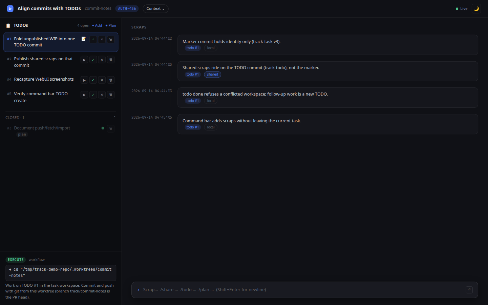
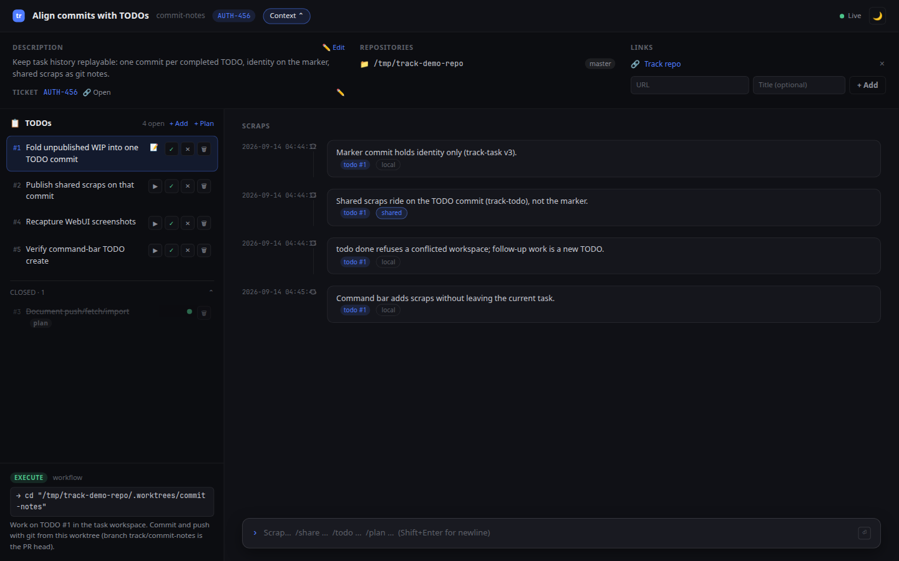
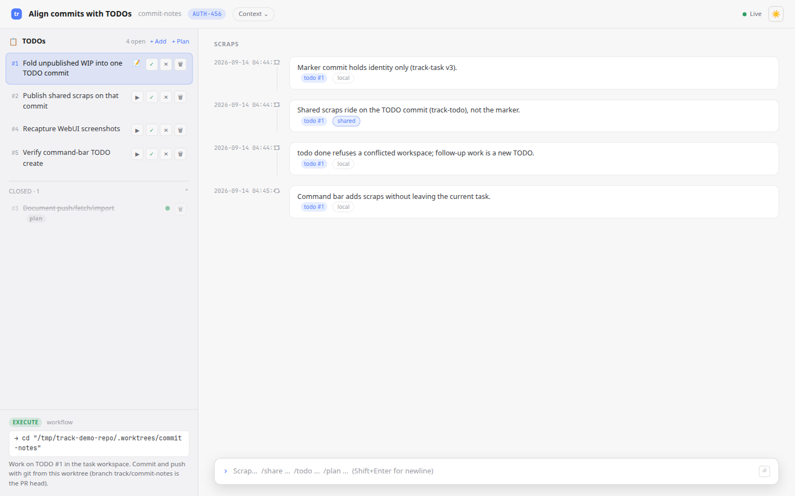

# Web UI

`track webui` serves a browser UI on port 3000 (override with `--port`; `--open` launches a browser). It is the same current-task database as the CLI. HTML is for humans; agents should use `track status --json` / mutation `--json` (the same snapshot is also at `GET /api/status`).



The current layout is Linear/Raycast-style: a compact topbar, a TODO rail, a scrap stream, and a command bar. An older two-pane “Focus Mode / Overview Mode” toggle was replaced by this layout.

## Start

```bash
track webui
track webui --port 8080
track webui --open
```

Open `http://localhost:3000`. Changes from the CLI or another browser tab show up over Server-Sent Events (SSE).

## Layout

- **Topbar**: brand, current task identity, Context chip, SSE connection status, dark/light theme toggle.
- **Context drawer** (collapsed by default): description, ticket, registered repos, and links. Today-task view can embed a Google Calendar iframe instead of description/ticket/repos — see [TODAY_TASK.md](TODAY_TASK.md).
- **TODO rail**: open TODOs (oldest pending is in progress), plan vs workspace items, jump-to-scraps, make-next / done / cancel. Closed TODOs sit behind a **CLOSED** toggle.
- **Workflow footer**: `workflow.phase`, next action, and checklist (same fields as CLI JSON).
- **Scrap stream**: chronological notes with local/shared, markdown, and optional `todo #N` links.
- **Command bar**: Enter submits; Shift+Enter is a newline.



## Command bar

| Input | Action |
|-------|--------|
| `text` | Add a local scrap |
| `/share text` | Add a scrap marked shared (git notes on the matching TODO commit when aggressive mode is on) |
| `/todo text` | Add a workspace TODO |
| `/plan text` | Add a research TODO (`--no-workspace`) |

The **+ Add** / **+ Plan** rail buttons focus the bar with `/todo` or `/plan`.

## Other behavior

- **Todo–scrap linking**: scraps attach to the active (oldest pending) TODO when created. The 📝 button on a TODO jumps to those scraps.
- **Todo reordering**: ▶ **Make next** (CLI: `track todo next`) moves a pending TODO to the front.
- **Real-time updates**: SSE named events swap HTMX partials; mutations return HTML.
- **Dark/Light theme**: stored in the browser; calendar colors adapt when a calendar is configured.
- **Safe markdown**: sanitized; raw HTML stripped; links open in a new tab.

Theme toggle (light):


